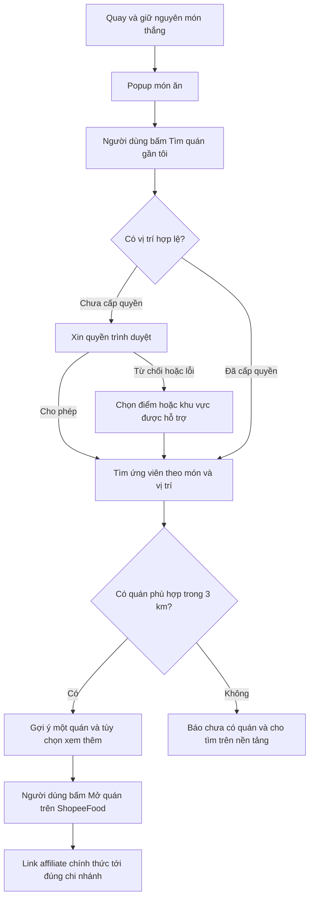

# Plan: từ món quay trúng đến quán ăn có affiliate

Ngày nghiên cứu: 20/09/2026. Trạng thái: đề xuất sản phẩm và kỹ thuật; chưa tích hợp API, đăng ký chương trình, tạo đơn hàng hoặc xác minh hoa hồng thực tế.

**Cập nhật triển khai:** đã bổ sung tìm món trên website ShopeeFood và gợi ý affiliate theo món đã xác minh. Popup mở sau quay hoặc khi bấm vào món trong thực đơn; nút sao chép đã bỏ theo yêu cầu. Người dùng cung cấp link Bún Đậu Phố Cổ và xác nhận bán bún đậu mắm tôm/bún chả; cấu hình local chỉ hiện quán cho hai món đó. Chưa có lọc 3 km/xếp hạng tự động hoặc xác minh tracking trên app. Xem [hướng dẫn và giới hạn bản triển khai](SHOPEEFOOD-SETUP.md).

## Cập nhật theo yêu cầu tiếp theo

Người dùng xác nhận đã có tài khoản ShopeeFood Affiliate và muốn tự động hóa, không thu thập URL từng quán thủ công. Cập nhật này thay thế đề xuất danh mục thủ công làm MVP mặc định ở các mục bên dưới; phần danh mục chỉ còn là phương án tham khảo nếu sau này đổi phạm vi.

- Luồng tự chọn chi nhánh trong 3 km theo rating cần đồng thời nguồn dữ liệu quán/menu/tọa độ/rating và cơ chế tạo link affiliate tự động được hỗ trợ cho ShopeeFood Việt Nam. Tài khoản Affiliate chưa chứng minh hai quyền này.
- Cổng [Shopee Affiliate Open API](https://affiliate.shopee.vn/open_api/list) đã được mở để kiểm tra và chuyển đến đăng nhập; chưa đọc được API mà tài khoản người dùng được cấp. Không suy ra API sản phẩm Shopee áp dụng cho Food.
- Luồng mở app với tên món điền sẵn cũng chưa được xác minh bằng tài liệu deep link chính thức. Link mở app, link tìm kiếm và link có attribution là ba khả năng cần kiểm thử riêng.
- Nếu chỉ mở app để người dùng tìm món theo địa chỉ đã thiết lập ở ShopeeFood, bỏ bước xin vị trí tại website. Quyền vị trí ở Chrome không tự chuyển tọa độ hay địa chỉ giao hàng sang app.
- Kiểm tra trong tài khoản xem chương trình có cấp link affiliate trang chủ/bộ sưu tập không. Nếu có, một link dùng chung có thể giảm công quản lý; chưa khẳng định link đó nhận từ khóa tìm kiếm hoặc mọi đơn sau đó đều được tính hoa hồng.
- Bước kế tiếp: xem tài liệu Open API được cấp cho tài khoản và một link affiliate mẫu; xác minh khả năng tạo link cho Food, nguồn discovery, đích đến trên thiết bị thật và phạm vi ghi nhận đơn. Không triển khai thuật toán chọn quán trước khi xác minh nguồn dữ liệu.

## 1. Quyết định đề xuất

Ưu tiên thử nghiệm **ShopeeFood Affiliate tại một khu vực nhỏ**, sau khi xác minh tài khoản và quyền sử dụng website. GrabFood có thể mở trực tiếp trang quán, nhưng chưa đủ bằng chứng công khai để chọn làm nền tảng kiếm hoa hồng hoặc tìm quán tự động cho MVP.

Tách ba năng lực độc lập:

1. Tìm quán phù hợp với món và vị trí.
2. Chọn đúng chi nhánh và mở trang quán.
3. Ghi nhận đơn hợp lệ và hoa hồng qua liên kết do chương trình cấp.

Một link chia sẻ quán chỉ giải quyết bước 2. Link affiliate cũng không tự cung cấp dữ liệu ở bước 1.

## 2. Kết quả nghiên cứu

| Nhu cầu | GrabFood Việt Nam | ShopeeFood Việt Nam |
| --- | --- | --- |
| Link tới từng quán | Có hướng dẫn chính thức trong GrabMerchant [1] | Shopee Blog xác nhận chia sẻ link quán trong ShopeeFood Affiliate [3] |
| Affiliate trả hoa hồng | Chưa tìm được chương trình công khai phù hợp cho website này | Có xác nhận chương trình; quyền của tài khoản và điều kiện Food cần kiểm tra [3] |
| API tìm quán theo món, vị trí, rating | Chưa tìm thấy trong tài liệu công khai đã kiểm tra | Chưa xác minh được API discovery cho Việt Nam |
| API quản lý quán | Tài liệu tìm được là POS, quản lý menu/đơn/cửa hàng; không chứng minh quyền tìm kiếm toàn thị trường [2] | Không dùng tài liệu vendor/POS thị trường khác để suy ra khả năng tìm quán tại Việt Nam |

“Chưa tìm thấy” không đồng nghĩa “không tồn tại”; có thể cần thỏa thuận đối tác riêng.

**Điều kiện kênh:** điều khoản Shopee chung hiện hành nói đến website được đăng ký/chấp thuận, thao tác mở link chủ động và hạn chế quảng bá đối thủ. Cần xác nhận cách áp dụng cho ShopeeFood và việc đặt GrabFood song song. Không suy diễn chính sách hoa hồng hàng hóa sang Food. [4]

## 3. Hiện trạng repository

- React/Vite chạy phía trình duyệt; README xác định đây là bản cộng đồng không cần backend. Frontend production ở repository riêng.
- `src/app/page.tsx`: popup kết quả có link tìm kiếm Google Maps và GrabFood theo tên món. Chưa có mã affiliate hoặc bước tìm một chi nhánh cụ thể.
- `src/lib/foods.ts`: dữ liệu món ăn, chưa có danh mục quán, tọa độ, rating, ID nền tảng hoặc liên kết với menu. Giá đang là tham khảo, không phải giá của quán.
- Sở thích và món cá nhân đang lưu bằng cookie. Giữ nguyên cơ chế này; không đưa vị trí chính xác vào cookie.
- Tài liệu sản phẩm riêng tư từng được tham chiếu (`PRODUCT_PHILOSOPHY.md`) chưa truy cập được. Trước triển khai production cần đọc tài liệu đó và xác định repository triển khai.

## 4. Luồng sản phẩm

Đây là điều chỉnh đề xuất so với tự chuyển ngay sau khi quay: thêm bước mở quán chủ động, giúp người dùng thấy đích đến và tránh chuyển ứng dụng bất ngờ. Popup hiện tại vẫn giữ nguyên vai trò công bố kết quả. Không đổi thuật toán hoặc thời gian quay để ưu tiên món có hoa hồng.

Geolocation cần sự cho phép của người dùng; website không thể tự bật quyền Chrome. Chỉ xin khi họ chọn tìm quán, dùng HTTPS khi triển khai. [5]

Trong popup, hiển thị tên quán/chi nhánh, địa chỉ, khoảng cách ước tính, nguồn rating và số lượt đánh giá nếu có. CTA rõ nền tảng đích; ghi chú ngắn rằng website có thể nhận hoa hồng từ liên kết.

Điểm tìm quán nên là **điểm muốn nhận đồ ăn**. Vị trí hiện tại chỉ là mặc định thuận tiện. Ứng dụng giao đồ ăn có thể vẫn yêu cầu đăng nhập, xác nhận địa chỉ, chọn món và thanh toán; chưa có bằng chứng cho phép truyền địa chỉ giao hàng từ website qua link.

## 5. Quy tắc tìm và xếp hạng

**Phạm vi:** “quán phù hợp có đánh giá cao nhất trong danh sách được hỗ trợ, trong bán kính 3 km”. Không quảng bá là cao nhất toàn Grab/ShopeeFood khi dữ liệu không bao phủ toàn bộ.

1. Chuẩn hóa món và ánh xạ tới món trong menu hoặc nhãn món đã xác minh. Không chỉ tìm tên quán có chứa từ khóa.
2. Chọn đúng chi nhánh có URL hợp lệ; giữ riêng từng chi nhánh cùng thương hiệu.
3. Lọc khoảng cách đường chim bay từ điểm nhận đến chi nhánh `<= 3.000 m`. Tính ở độ chính xác gốc, chỉ làm tròn khi hiển thị. Khoảng cách này không phải quãng đường giao hàng hoặc cam kết giao được.
4. Loại quán được xác nhận đã đóng/ngừng bán món. Nếu không có dữ liệu thời gian thực, hiển thị trạng thái chưa xác minh; để nền tảng xác nhận khả năng đặt.
5. Trong cùng nguồn rating: điểm giảm dần; nếu bằng nhau, số đánh giá giảm dần; tiếp theo khoảng cách tăng dần và ID ổn định.
6. Không trộn điểm Google, Grab và ShopeeFood thành cùng một thang xếp hạng. Rating thiếu không được biến thành 0 hoặc điểm giả.
7. Hiển thị một lựa chọn chính và tối đa hai lựa chọn thay thế. Hoa hồng không tham gia điểm xếp hạng. Nếu tập ứng viên chỉ gồm quán affiliate, phải nói rõ phạm vi đó.

Mức đánh giá 5 sao với rất ít lượt có thể kém đáng tin hơn 4,8 sao với nhiều lượt. Có thể bổ sung ngưỡng số đánh giá tối thiểu sau thử nghiệm, nhưng đó là thay đổi quy tắc sản phẩm; MVP mặc định giữ thứ tự người dùng yêu cầu.

Các trường hợp đặc biệt:

- Không có quán trong 3 km: báo đúng tình trạng, cho đổi điểm tìm kiếm hoặc mở tìm kiếm trên nền tảng. Không tự nới bán kính.
- Vị trí kém chính xác: cho thử lại hoặc đổi điểm. Nếu chỉ chọn khu vực rộng, phải ghi rõ khoảng cách tính từ điểm đại diện, không khẳng định 3 km từ người dùng.
- Món riêng chưa ánh xạ: vẫn quay bình thường, dùng tìm kiếm thông thường hoặc cho sửa từ khóa; không tự gán sai quán affiliate.
- Bộ lọc chay: chỉ đề xuất món/menu đã xác minh phù hợp; không suy ra quán nào có tên “rau” cũng phù hợp.
- Giá tham khảo của vòng quay không được hiển thị như giá thực tế của quán.

## 6. Nguồn dữ liệu và kiến trúc

### MVP đề xuất: danh mục nhỏ, kiểm duyệt trước

Dùng dữ liệu có quyền sử dụng từ chương trình hoặc quán cung cấp, chuẩn bị dưới dạng JSON có phiên bản. Link affiliate được lấy nguyên vẹn từ công cụ chính thức; không tự ghép tham số để giả lập affiliate.

Ánh xạ nhiều–nhiều: `dishId -> branchId -> platformListing`. Một món có nhiều quán, mỗi chi nhánh có thể có nhiều nền tảng.

Thông tin cần quản lý:

- Món: ID ổn định, tên, từ khóa tương đương, nhãn chay và ánh xạ menu.
- Chi nhánh: ID, tên, địa chỉ, tọa độ, nguồn dữ liệu và ngày kiểm tra.
- Listing: nền tảng, merchant ID nếu được cung cấp, URL quán, URL affiliate, trạng thái đủ điều kiện và ngày kiểm tra link.
- Rating: nguồn, điểm, số lượt, thời điểm xác minh và quyền hiển thị/lưu trữ. Tách khỏi dữ liệu lâu dài nếu nguồn hạn chế lưu.
- Trạng thái hoạt động/menu: xác minh được hoặc chưa biết; không có giá trị giả để lấp chỗ trống.

Có thể tính khoảng cách và xếp hạng ngay trên trình duyệt với danh mục nhỏ này. Không cần backend cho việc mở link đã được cấp. Vị trí ở bộ nhớ phiên; không gắn vào affiliate URL, analytics hoặc log. Khả năng cập nhật quán/giá/rating là giới hạn vận hành của phương án này.

### Mở rộng: API đối tác được cấp quyền

Chỉ làm khi có nguồn discovery đáp ứng dữ liệu cần thiết. Nếu nguồn yêu cầu khóa bí mật, bổ sung endpoint phía server để bảo vệ khóa, giới hạn lưu lượng và ngân sách; không đặt khóa trong bundle Vite. Đây là mở rộng phạm vi so với bản local hiện tại, cần chốt repository và hạ tầng trước triển khai.

Google Places là phương án dữ liệu địa điểm phụ: hỗ trợ tìm theo tên và trả rating, nhưng không cung cấp sẵn ánh xạ affiliate Grab/ShopeeFood. `locationBias` không phải bộ lọc 3 km cứng; cần lọc lại khoảng cách. Kết quả giới hạn nên không bảo đảm tìm được mọi quán. [6]

Nếu chọn Places: cần dự toán phí, ghi công nguồn và tuân thủ giới hạn lưu trữ. Không sao chép rating Google vào JSON lâu dài. [7] Chưa khuyến nghị dùng nguồn này cho MVP vì vẫn phải giải quyết ánh xạ đúng chi nhánh/menu.

Không dựa vào scraping hoặc endpoint nội bộ của app làm nền tảng production.

## 7. Các giai đoạn và điều kiện hoàn thành

| Giai đoạn | Công việc | Điều kiện chuyển bước |
| --- | --- | --- |
| 0. Xác minh khả thi | Kiểm tra tài khoản ShopeeFood Affiliate; quyền đặt link trên domain; quy định Food và việc hiển thị Grab; lấy 3–5 link được cấp; hỏi Grab về discovery/affiliate riêng [8] | Link mở đúng chi nhánh trên thiết bị thật; có điều kiện tracking bằng văn bản/tài khoản; không nhầm link chia sẻ với affiliate |
| 1. Pilot dữ liệu | Chọn một khu vực, đề xuất 10–15 món phổ biến và 20–40 chi nhánh thực; kiểm tra menu, vị trí, link, nguồn rating | Mỗi đề xuất truy được nguồn và chi nhánh; xác định độ phủ và phần còn thiếu; nếu thiếu rating hợp lệ, không tuyên bố xếp hạng |
| 2. MVP giao diện | Bổ sung phần tìm quán trong popup, quyền vị trí, điểm tìm kiếm thay thế, xếp hạng, liên kết và trạng thái lỗi; giữ vòng quay hiện tại | Luồng có/không quyền đều sử dụng được; không ảnh hưởng món cá nhân, bộ lọc, cookie và kết quả quay |
| 3. Kiểm thử pilot | Kiểm tra Android/iOS/desktop, bán kính, menu và link; đối chiếu click/đơn/hoa hồng với báo cáo đối tác theo quy trình cho phép | Có bằng chứng mở đúng quán và tracking hợp lệ; có cơ chế tắt link lỗi; không dùng click thay cho số đơn |
| 4. Mở rộng | Bổ sung khu vực, nguồn dữ liệu hoặc API đã được cấp; đo chi phí và cập nhật dữ liệu | Dữ liệu đủ mới, chi phí chấp nhận được, quy trình vận hành có người phụ trách |

Ước lượng lập kế hoạch cho một developer: sau khi có tài khoản, quyền dữ liệu và link mẫu, 1–2 ngày kiểm chứng link; 2–4 ngày chuẩn bị pilot dữ liệu; 3–5 ngày MVP; 2–3 ngày QA. Tổng khoảng 8–14 ngày làm việc; không bao gồm thời gian đối tác duyệt, ghi nhận/đối soát hoa hồng hoặc xây API thương mại chưa có tài liệu. Đây là dự toán, không phải cam kết lịch.

## 8. Kiểm thử và đo lường

- Quyền vị trí: chưa hỏi, cho phép, từ chối, bị chặn, timeout, vị trí kém chính xác, đổi điểm nhận. Không hỏi lặp sau khi từ chối.
- Khoảng cách: ngay dưới/đúng/ngay trên 3 km; chi nhánh trùng tên; không lấy số đã làm tròn để lọc.
- Xếp hạng: bằng điểm, thiếu số lượt, thiếu rating, nguồn rating khác nhau; chỉ chọn trong tập ứng viên hợp lệ.
- Món: chay, món riêng, không có ánh xạ, quán hết món/đóng cửa, link hết hạn hoặc đổi chi nhánh.
- Trạng thái bất đồng bộ: đóng popup/quay lại/đổi món trong khi tìm; bỏ kết quả cũ; chống bấm lặp và request trùng.
- Chuyển app: Chrome Android có/không cài app; iOS Safari/Chrome; desktop; người dùng chưa đăng nhập; quay lại webapp không mất kết quả. Không mặc định desktop sẽ chuyển sang điện thoại.
- Affiliate: link cấp thật, đủ điều kiện chiến dịch, chuyển sang app còn attribution, trạng thái đơn bị hủy không coi là hoa hồng nhận được. Không tự đặt đơn qua link của mình để thử nếu chương trình không cho phép.
- UI: 360 px, bàn phím/focus popup, trình đọc màn hình, loading/lỗi/không có quán; giữ nguyên reduced motion và thời gian quay.
- Chạy test/build hiện có cùng các test khoảng cách/xếp hạng và trạng thái mới khi triển khai.

Chỉ số pilot: tỷ lệ tìm có quán, tỷ lệ mở quán, lỗi link/chi nhánh, thời gian tìm; đơn được nền tảng ghi nhận, hoa hồng đã duyệt, chi phí dữ liệu trên đơn hợp lệ. Không suy ra đã đặt thành công chỉ từ việc người dùng rời website. Đo tổng hợp, không cần lưu lịch sử vị trí cá nhân.

## 9. Thông tin cần chốt trước triển khai

1. Đã xác nhận có tài khoản ShopeeFood Affiliate. Cần kiểm tra quyền Open API, dữ liệu tìm quán và link affiliate mẫu được tài khoản cấp.
2. Khu vực pilot và điểm nhận mặc định: vị trí hiện tại hay người dùng chọn?
3. Nguồn rating/menu/tọa độ nào có quyền sử dụng, độ mới bao nhiêu?
4. Domain affiliate và repository triển khai thực tế; giới hạn backend/API được chấp nhận?
5. Ai cập nhật danh mục/link và kiểm tra báo cáo hoa hồng?

## Nguồn kiểm chứng

1. [GrabMerchant — Hoàn thiện thông tin quán, tính năng chia sẻ link quán](https://merchant.grab.com/vn-vn/blog/dieuchinhthongtincuahang).
2. [GrabFood Partner API (POS) Integration Guide 1.1.3](https://developer.grab.com/docs/grabfood/api/v1-1-3/).
3. [Shopee Blog — Cách làm Affiliate Shopee, bảng có ShopeeFood Affiliate](https://shopee.vn/blog/?p=188301).
4. [Shopee — Điều khoản chung cập nhật 08/07/2026](https://help.shopee.vn/portal/10/article/122944). Cần đọc lại bản hiệu lực tại thời điểm launch và quy định riêng Food trong tài khoản.
5. [W3C — Geolocation](https://www.w3.org/TR/geolocation/).
6. [Google — Places Text Search (New)](https://developers.google.com/maps/documentation/places/web-service/text-search).
7. [Google — Places policies and attributions](https://developers.google.com/maps/documentation/places/web-service/policies).
8. [Grab Developer — Contact us](https://developer.grab.com/contact-us).
